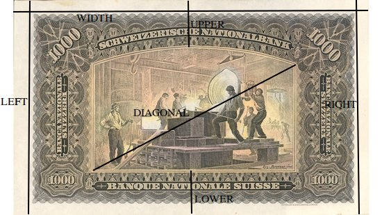

```{r setup, include=FALSE}
library("printr")
knitr::opts_chunk$set(echo = TRUE)
#
allbus_data <- list(
  erhebungsgebiet       = "eastwest", # ERHEBUNGSGEBIET (WOHNGEBIET): WEST - OST
  wirtschaftbefrheute   = "ep03",     # WIRTSCHAFTSLAGE, BEFR. HEUTE
  wirtschaftbefrzukunft = "ep06",     # WIRTSCHAFTSLAGE, BEFR. IN 1 JAHR   
  netincomeV            = "di05",     # HAUSHALTSNETTOEINKOMMEN: OFFENE ABFRAGE
  netincomeC            = "di06",     # HAUSHALTSNETTOEINKOMMEN: LISTENABFRAGE
  netincomeM            = "hhinc",    # HAUSHALTSEINK.(OFFENE+LISTENANGABE),KAT.
  bundesland            = "land",     # BUNDESLAND, IN DEM BEFRAGTE(R) WOHNT
  vgesund               = "pt01",     # VERTRAUEN: GESUNDHEITSWESEN 
  vbvg                  = "pt02",     # VERTRAUEN: BUNDESVERFASSUNGSGERICHT
  vbtag                 = "pt03",     # VERTRAUEN: BUNDESTAG
  vstadt                = "pt04",     # VERTRAUEN: STADT-, GEMEINDEVERWALTUNG
  vjustiz               = "pt08",     # VERTRAUEN: JUSTIZ 
  vtv                   = "pt09",     # VERTRAUEN: FERNSEHEN 
  vzeitung              = "pt10",     # VERTRAUEN: ZEITUNGSWESEN 
  vuni                  = "pt11",     # VERTRAUEN: HOCHSCHULEN, UNIVERSITAETEN 
  vregierung            = "pt12",     # VERTRAUEN: BUNDESREGIERUNG
  vpolizei              = "pt14",     # VERTRAUEN: POLIZEI
  vpartei               = "pt15",     # VERTRAUEN: POLITISCHE PARTEIEN 
  veukom                = "pt19",     # VERTRAUEN: KOMMISSION DER EU 
  veupar                = "pt20"      # VERTRAUEN: EUROPAEISCHES PARLAMENT 
  )
```

All data sets, except Cereal data, are either part of R or can be downloaded from \url{https://shinyapps.wiwi.hu-berlin.de/d}.

## ALLBUS 2018

ALLBUS 2018 data set (Allgemeine Bevölkerungsumfrage der Sozialwissenschaften).

| Variable                              | Content and coding                       |
|:--------------------------------------|:-----------------------------------------|
| `r allbus_data$erhebungsgebiet`       | ERHEBUNGSGEBIET (WOHNGEBIET): WEST - OST |
| `r allbus_data$wirtschaftbefrheute`   | WIRTSCHAFTSLAGE, BEFR. HEUTE             |
| `r allbus_data$wirtschaftbefrzukunft` | WIRTSCHAFTSLAGE, BEFR. IN 1 JAHR         |
| `r allbus_data$netincomeV`            | HAUSHALTSNETTOEINKOMMEN: OFFENE ABFRAGE  |
| `r allbus_data$netincomeC`            | HAUSHALTSNETTOEINKOMMEN: LISTENABFRAGE   |
| `r allbus_data$netincomeM`            | HAUSHALTSEINK.(OFFENE+LISTENANGABE),KAT. |
| `r allbus_data$bundesland`            | BUNDESLAND, IN DEM BEFRAGTE(R) WOHNT     |
| `r allbus_data$vgesund`               | VERTRAUEN: GESUNDHEITSWESEN              |
| `r allbus_data$vbvg`                  | VERTRAUEN: BUNDESVERFASSUNGSGERICHT      |
| `r allbus_data$vbtag`                 | VERTRAUEN: BUNDESTAG                     |
| `r allbus_data$vstadt`                | VERTRAUEN: STADT-, GEMEINDEVERWALTUNG    |
| `r allbus_data$vjustiz`               | VERTRAUEN: JUSTIZ                        |
| `r allbus_data$vtv`                   | VERTRAUEN: FERNSEHEN                     |
| `r allbus_data$vzeitung`              | VERTRAUEN: ZEITUNGSWESEN                 |
| `r allbus_data$vuni`                  | VERTRAUEN: HOCHSCHULEN, UNIVERSITAETEN   |
| `r allbus_data$vregierung`            | VERTRAUEN: BUNDESREGIERUNG               |
| `r allbus_data$vpolizei`              | VERTRAUEN: POLIZEI                       |
| `r allbus_data$vpartei`               | VERTRAUEN: POLITISCHE PARTEIEN           |
| `r allbus_data$veukom`                | VERTRAUEN: KOMMISSION DER EU             |
| `r allbus_data$veupar`                | VERTRAUEN: EUROPAEISCHES PARLAMENT       |

```{r, message=FALSE}
library("mmstat4")
allbus <- ghload("data/allbus2018.rds")
str(allbus, give.attr=FALSE)
```

```{r, echo=FALSE}
library("rio")
x <- import("ALLBUS2018.sav")
vars <- c(
"eastwest", # ERHEBUNGSGEBIET (WOHNGEBIET): WEST - OST
"ep03",     # WIRTSCHAFTSLAGE, BEFR. HEUTE
"ep06",     # WIRTSCHAFTSLAGE, BEFR. IN 1 JAHR
"di05",     # HAUSHALTSNETTOEINKOMMEN: OFFENE ABFRAGE
"di06",     # HAUSHALTSNETTOEINKOMMEN: LISTENABFRAGE
"hhinc",    # HAUSHALTSEINK.(OFFENE+LISTENANGABE),KAT.
"land",     # BUNDESLAND, IN DEM BEFRAGTE(R) WOHNT
"pt01",     # VERTRAUEN: GESUNDHEITSWESEN
"pt02",     # VERTRAUEN: BUNDESVERFASSUNGSGERICHT
"pt03",     # VERTRAUEN: BUNDESTAG
"pt04",     # VERTRAUEN: STADT-, GEMEINDEVERWALTUNG
"pt08",     # VERTRAUEN: JUSTIZ
"pt09",     # VERTRAUEN: FERNSEHEN
"pt10",     # VERTRAUEN: ZEITUNGSWESEN
"pt11",     # VERTRAUEN: HOCHSCHULEN, UNIVERSITAETEN
"pt12",     # VERTRAUEN: BUNDESREGIERUNG
"pt14",     # VERTRAUEN: POLIZEI
"pt15",     # VERTRAUEN: POLITISCHE PARTEIEN
"pt19",     # VERTRAUEN: KOMMISSION DER EU
"pt20"      # VERTRAUEN: EUROPAEISCHES PARLAMENT
)
allbus2018 <- x[,vars]
saveRDS(allbus2018, file = "allbus2018.rds", version=2)
```

## Body data

The `sas body` data set consists of data about children taken from the SAS online documentation V8:

| Variable | Content and coding                       |
|:---------|:-----------------------------------------|
| sex      | 	sex of child                            |
| age      | 	age in months                           |
| height   | 	height in inches                        |
| weight   | 	weight in pounds                        |

```{r}
library("mmstat4")
body <- ghload("data/body.rds")
str(body, give.attr=FALSE)
```

```{r, echo=FALSE}
saveRDS(import("sas_body.sav"), file = "body.rds", version=2)
```

## Boston Housing data

### `MASS::Boston`

```{r, echo=FALSE, warning=FALSE, printr.help.sections=c("description", "format", "source")}
?MASS::Boston
```

### `spData::boston.c`

```{r, echo=FALSE, warning=FALSE, printr.help.sections=c("description", "format", "source", "references")}
?spData::boston
```

## Cereal data

```{r, include=FALSE}
df <- data.frame(Child  = 1:25,
                 Cereal = strsplit("gggcttttgctgttgcttgtctgtt", "")[[1]],
                 Like   = strsplit("clnnccclcnclclcdcllclcllc", "")[[1]],
                 Gift   = strsplit("sssrsrsrrssrsrwrwrscrsrrr", "")[[1]],
                 Gender = strsplit("mmmmffffmfffmmfmfffmfmfff", "")[[1]])
df$Cereal <- factor(df$Cereal, labels=c("Canary Crunch", "Ghostly Shadows",  "Turtle Treats"))
df$Like   <- factor(df$Like,   labels=c("crazy", "don't know", "like", "not part"))
df$Gift   <- factor(df$Gift,   labels=c("can't decide", "ring", "squirt gun", "whistle"))
df$Gender <- factor(df$Gender,  labels=c("F", "M"))
library("grid")
library("gridExtra")
go        <- tableGrob(df)
maxheight <- convertHeight(sum(go$heights), "in", TRUE)
pdf("cereal.pdf", height=maxheight)
grid.draw(go)
dev.off()
```


## Concrete data

Read in the `concrete` data set (from UCI Machine Learning Repository).

* Yeh, I-Cheng (2007) _Modeling slump flow of concrete using second-order regressions and 
	artificial neural networks_, Cement and Concrete Composites, Vol.29, No. 6, 474-480.

| Variable   | Content and coding                       |
|:-----------|:-----------------------------------------|
| Cement     | Cement (in kg/m$^3$ concrete)            |
| Slag       | Slag (in kg/m$^3$ concrete)              |
| Flyash     | Fly ash (in kg/m$^3$ concrete)           |
| Water      | Water (in kg/m$^3$ concrete)             |
| SP         | Superplasticizer (in kg/m$^3$ concrete)  |
| CoarseAggr | Coarse sand (in kg/m$^3$ concrete)       |
| FineAggr   | Fine sand (in kg/m$^3$ concrete)         |
| Slump      | Slump (in cm)                            |
| Flow       | Flow (in cm)                             |
| Strength   | 28day compressive strength (in Megapascal)| 

Data about concrete mixtures and resulting properties (Slump, Flow and Strength). Input variables are:

* __Water content__ ACI 211.1 (Standard practice for selecting proportions for normal, heavyweight, and mass concrete) assumes that, for a given maximum size of coarse aggregate, the slump or consistency of concrete is a direct function of the water content; i.e., within limits it is independent of other factors such as aggregate grading and cement content.
* __Superplasticizer__ When the water content of a concrete mixture is held constant, the addition of a superplasticizer will increase the consistency.
* __Pozzolanic admixtures__ Pozzolanic admixtures tend to improve the cohesiveness of concrete. Fly ash, when used as a partial replacement for fine aggregate, generally increases the consistency at a given water content.
* __Cement content__ Concretes containing a very high proportion of cement show excellent cohesiveness, but tend to be sticky. At a given water content, a considerable lowering of the cement content tends to produce harsh mixtures, with poor cohesiveness.
* __Aggregate characteristics__ Very fine sands require more water for a given consistency; alternatively, they will produce harsh and unworkable mixtures at a water content that might have been adequate with coarser sands. Also, the particle size of coarse aggregate influences the water requirement for a given consistency.

```{r}
library("mmstat4")
concrete <- ghload("data/concrete.rds")
str(concrete, give.attr=FALSE)
```

```{r, include=FALSE}
saveRDS(import("concrete.sav"), file = "concrete.rds", version=2)
```

## Country data

The `country` are data about the most countries in the world in 1992.

| Variable | Content and coding                       |
|:---------|:-----------------------------------------|
| lifeexpf | female life expentancy                   |
| birthrat | birthrate                                |
| lifeexpm | male life expectancy                     |
| urban    | percentage urban                         |
| lndocs   | log of dcotors per 10.000 people         |
| lnbeds   | log of hospital beds per 10.000 people   |
| lngdp    | log of GDP                               |
| lnradio  | log of radios per 100 people             |

```{r}
library("mmstat4")
country <- ghload("data/country.rds")
str(country, give.attr=FALSE)
```

```{r, include=FALSE}
saveRDS(import("COUNTRY.SAV"), file = "country.rds", version=2)
```

## Current population survey (CPS)

The `cps`data are an excerpt of the current population survey of the US.


| Variable | Content and coding                       |
|:---------|:-----------------------------------------|
| educ     | Number of years of education             |
| south    | Indicator variable for Southern Region   |
| nonwhite | Indicator variable for non-whites        |
| female   | Indicator variable for sex               |
| married  | Marital Status                           |
| exper    | Number of years of work experience       |
| expersq  | Number of years of work experience squared|
| lwage    | Log(wage), (wage in dollars per hour)    |
| union    | Indicator variable for union membership  |
| age      | Age (years)                              |
| year     | Year of survey (either 78 or 85)         |

```{r}
library("mmstat4")
cps <- ghload("data/cps.rds")
str(cps, give.attr=FALSE)
```

```{r, include=FALSE}
saveRDS(import("CPS78-85.sav"), file = "cps.rds", version=2)
```

## Datasaurus

The data are created by Matejka, J., \& Fitzmaurice, G. (2017).
[{Same Stats, Different Graphs: Generating Datasets with Varied Appearance and Identical Statistics through Simulated Annealing}(https://www.autodeskresearch.com/publications/samestats). __CHI 2017 Conference proceedings: ACM SIGCHI Conference on Human Factors in Computing Systems.__ The data are part of the R library `datasauRus`.

| Variable | Content and coding                       |
|:---------|:-----------------------------------------|
| dataset  | indicates which dataset the data are from|
| x        | x-values                                 |
| y        | y-values                                 |

```{r}
library("datasauRus")
str(datasaurus_dozen, give.attr=FALSE)
```

## General Social Survey data

The General Social Survey data set is the US equivalent to ALLBUS.

| Variable | Content and coding                       |
|:---------|:-----------------------------------------|
| age      | Age of Respondent                        |
| sex      | Respondent's Sex (1=Male, 2=Female)      |
| educ     | Highest Year of School Completed         | 
| sibs     | Number of brothers and sisters           |
| life     | Is life dull (=1), routine (=2) or exciting (=3)|
| speduc   | Highest Year of School Completed by Spouse|
| paeduc   | Highest Year of School Completed by Father|
| maeduc   | Highest Year of School Completed by Mother|
| tvhours  | Hours of Television Watched              |
| wrkstat  | Labor Force Status (1=Working fulltime)  |
| hrs1     | Number of Hours Worked Last Week         |
| incomdol | Household Income (in US$)                |
| rincmdol | Respondent's Income (in US$)             |
| wifeduc  | Wife: number of years of education       |
| husbeduc | Husband: number of years of education    |
| husbhr   | hrs worked last week by husband          |
| wifehr   | hrs worked last week by wife             |
| wifeft   | Wife employed full time (0=No, 1=Yes)    |
| happy    | General happiness (1=Very Happy, 2=Pretty happy, 3=Not too happy, NA=NAP/DK/NA)|
| hapmar   | Happiness of marriage (coding as in happy)|

```{r}
library("mmstat4")
gss <- ghload("gss.rds")
str(gss, give.attr=FALSE)
```

```{r, include=FALSE}
x <- import("GSS.SAV")
vars <- c(
"age",
"sex",
"educ",
"sibs",
"life",
"speduc",
"paeduc",
"maeduc",
"tvhours",
"wrkstat",
"hrs1",
"incomdol",
"rincmdol",
"wifeduc",
"husbeduc",
"husbhr",
"wifehr",
"wifeft",
"happy",
"hapmar")
gss <- x[,vars]
saveRDS(gss, file = "gss.rds", version=2)
```

## Iris flower

```{r, echo=FALSE, warning=FALSE, printr.help.sections=c("description", "format", "source", "references")}
?iris
```

## Olympic decathlon

The Olympic decathlon data set gives the performances of 33 men's decathlon at the Olympic Games (1988).

| Variable | Content and coding                 | Unit (points)                        |
|:---------|:-----------------------------------|:-------------------------------------|
| Nr       | Sequence number                    |                                      |
| @100     | 100 metres dash / 100m Lauf        | seconds ($25.4347(18-x)^{1.81}$)     |	
| long     | Long jump / Weitsprung             | centimeter  ($0.14354(x-220)^{1.40}$)|
| poid     | Shot put / Kugelstossen            | meter ($51.39(x-1.5)^{1.05}$)        |
| haut     | High jump / Hochsprung             | centimeter ($0.8465(x-75)^{1.42}$)   |	
| @400     | 400 metres dash / 400m Lauf        | seconds ($1.53775(82-x)^{1.81}$)     |	
| @110     | 110 metres hurdles / 110m H\"urden | seconds ($5.74352(28.5-x)^{1.92}$)   |	
| disq     | Discus throw / Diskuswerfen        | meter ($12.91(x-4)^{1.1}$)           |	
| perc     | Pole vault / Stabhochsprung        | centimeter ($50.2797(x-100)^{1.35}$) |	
| jave     | Javelin / Speerwurf                | meter  ($10.14(x-7)^{1.08})$         |	
| @1500    | 1500 metres dash / 1500m Lauf      | seconds  ($0.03768(480-x)^{1.85}$)   |	
| score    | Scores / Punkte                    | points                               |

```{r}
library("mmstat4")
cps <- ghload("data/olympic.rds")
str(cps, give.attr=FALSE)
```

```{r, include=FALSE}
saveRDS(import("olympic.sav"), file = "olympic.rds", version=2)
```

## Pechstein

Claudia Pechstein is a German speed skater who has won five Olympic gold medals. With a total of nine Olympic medals, she was one of the most successful Olympic speed skaters. After the 2009 World Championships, Pechstein was accused of blood doping and banned from all competitions for two years.

The data set `pechstein` contains the measurements published by the newspaper BILD in Germany.
The data set `pechstein_isu` contains the measurements used by the International Skating Unit.

### `pechstein`

| Variable      | Content and coding                 | 
|:--------------|:-----------------------------------|
| Datum         | Date                               |
| Tag           | Days since 1st Jan 2000            | 
| Retikulozyten | Reticulocyte value                 | 

```{r}
library("mmstat4")
pechstein <- ghload("data/pechstein.rds")
str(pechstein, give.attr=FALSE)
```

```{r, include=FALSE}
saveRDS(import("pechstein.csv",  sep="\t", dec=","), file = "pechstein.rds", version=2)
```

### `pechstein_isu`

`(Out of Competition)` means the measurement was taken in some training site, 
otherwise it was taken at a competition site

| Variable      | Content and coding                 | 
|:--------------|:-----------------------------------|
| no            | Number of measurement              | 
| date          | Day of measurement                 | 
| place         | Place of measurement               | 
| reti          | Reticulocyte value                 | 

```{r}
library("mmstat4")
pechstein_isu <- ghload("data/pechstein_isu.rds")
str(pechstein_isu, give.attr=FALSE)
```

```{r, include=FALSE}
saveRDS(import("pechstein_isu.csv"), file = "pechstein_isu.rds", version=2)
```

## Salary data

The data set contains information about 474 employees hired by the Harris Trust and Savings Bank between 1969 and 1971. The bank was involved into a Equal Employment Opportunity litigation were the data was used. For additional information see: 

* Roberts, H.V. (1979) _An analysis of employee compensation._ Report 7946, Center for Mathematical Studies in Business and Economics, University of Chicago.
* Roberts, H.V. (1980) _Statistical bases in the measurement of employment discrimination._ In: Comparable Worth: Issues and Alternatives by E.R. Livernash (ed.) Washington, D.C.: Equal Employment Advisory Council.

| Variable | Content and coding         | Unit/values                          |
|:---------|:---------------------------|:-------------------------------------|
| Variable | Label                      | Unit/values                          |
| salbeg   | beginning salary           | US\$                                 |
| sex      | sex of employee            | males, females                       |
| time     | job seniority              | years                                |
| age      | age of employee            | years                                |
| salnow   | current salary             | US\$                                 |
| edlevel  | educational level          | years                                |
| work     | work experience            | years                                |
| jobcat   | employment category        | clerical, office trainee, security officer, college trainee, exempt employee, mba trainee, technical |
| minority | minority classification    | white, nonwhite                      |
| sexrace  | sex \& race classification | white males, minority males, white females, minority females|


```{r}
library("mmstat4")
salary<- ghload("data/salary.rds")
str(salary, give.attr=FALSE)
```

```{r, include=FALSE}
saveRDS(import("salary.sav"), file = "salary.rds", version=2)
```

## Swiss banknote data

The data are taken from the book of Flury, B. and Riedwyl, H. (1988). \textit{Multivariate Statistics: A practical approach}. London: Chapman \& Hall. They are about the measurement of 200 genuine and forged old Swiss bank notes.

| Variable      | Content and coding                             | 
|:--------------|:-----------------------------------------------|
| WIDTH (X1)    | Width of the bank note                         |
| LEFT (X2)     | Height of the bank note, measured on the left  |
| RIGHT (X3)    | Height of the bank note, measured on the right |
| LOWER (X4)    | Distance of inner frame to the lower border    |
| UPPER (X5)    | Distance of inner frame to the upper border    |
| DIAGONAL (X6) | Length of the diagonal                         |

[](https://www.snb.ch/en/iabout/cash/history/id/cash_history_serie2\#t2)

```{r}
library("mmstat4")
bank2 <- ghload("data/bank2.rds")
str(bank2, give.attr=FALSE)
```

```{r, include=FALSE}
saveRDS(import("BANK2.sav"), file = "bank2.rds", version=2)
```

## `datasets::Titanic`

```{r, echo=FALSE, warning=FALSE, printr.help.sections=c("description", "format", "source", "references")}
?Titanic
```
